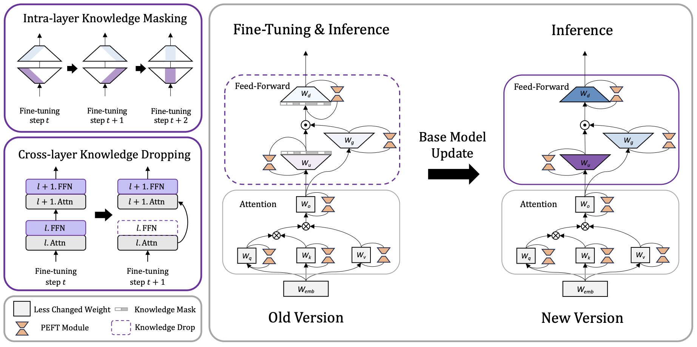

# Trans-PEFT
Here is the implementation of our ACL2025 paper "[Adapt Once, Thrive with Updates: Transferable Parameter-Efficient Fine-Tuning on Evolving Base Models](https://www.arxiv.org/abs/2506.06844)".

## Setup

```bash
## Training Environment (trans-peft)
pip install -r requirements-train.txt
cd peft
pip install -e .
cd ../transformers
pip install -e .

## Inference Environment (math_infer)
pip install -r requirements-infer.txt
cd peft
pip install -e .
```

## Examples
Trans-PEFT$_{o\rightarrow n}$
```bash
bash ./scripts/trans-peft-qwen.sh
```

Direct Transfer$_{o\rightarrow n}$ and Fine-tune$_{o}$
```bash
bash ./scripts/direct-trans-qwen.sh
```

Fine-tune$_{n}$
```bash
bash ./scripts/vanilla-ft-qwen.sh
```

## Citation
```
@misc{gu2025adaptoncethriveupdates,
      title={Adapt Once, Thrive with Updates: Transferable Parameter-Efficient Fine-Tuning on Evolving Base Models}, 
      author={Naibin Gu and Peng Fu and Xiyu Liu and Ke Ma and Zheng Lin and Weiping Wang},
      year={2025},
      eprint={2506.06844},
      archivePrefix={arXiv},
      primaryClass={cs.CL},
      url={https://arxiv.org/abs/2506.06844}, 
}
```

## Acknowledgement
This repo benefits from [PEFT](https://github.com/huggingface/peft), [LLM-Adapters](https://github.com/AGI-Edgerunners/LLM-Adapters), [MoRA](https://github.com/kongds/MoRA), [ReLoRA](https://github.com/Guitaricet/relora), and [PiSSA](https://github.com/GraphPKU/PiSSA). Thanks to their great work!
